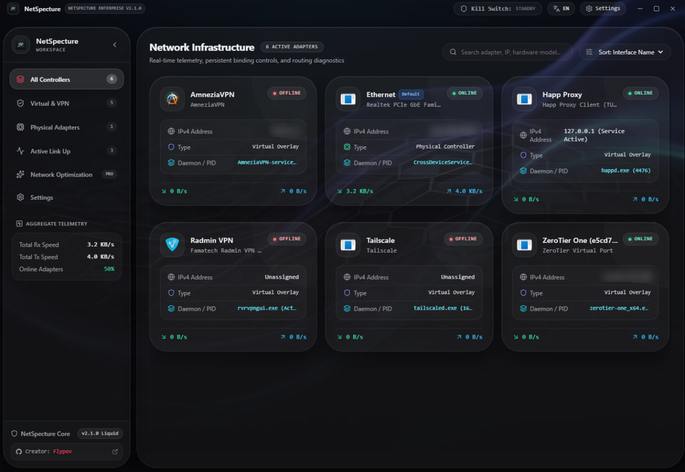
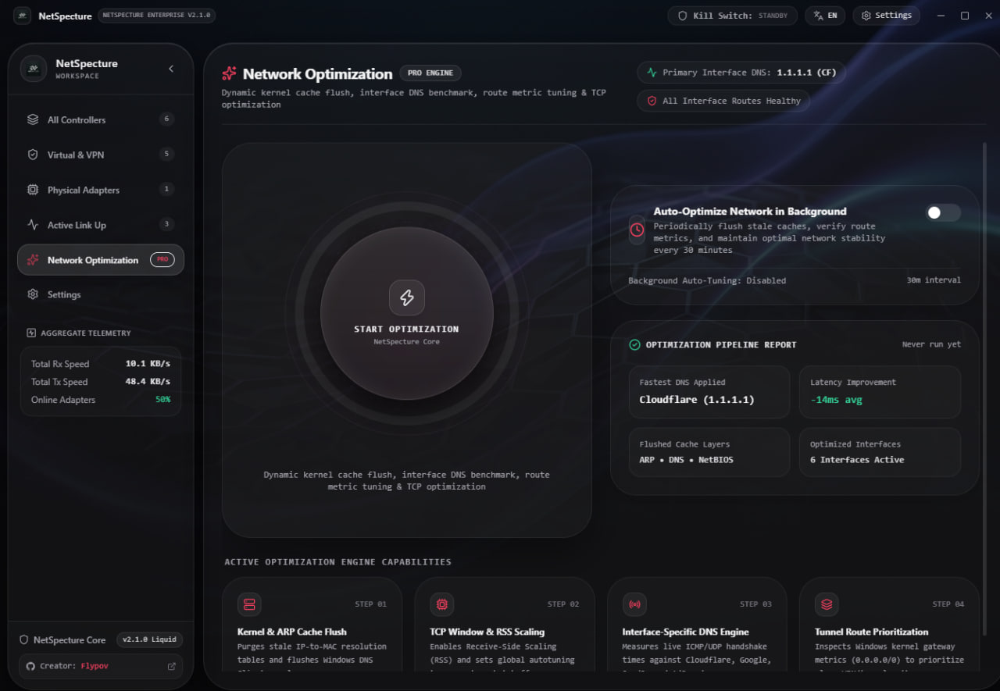
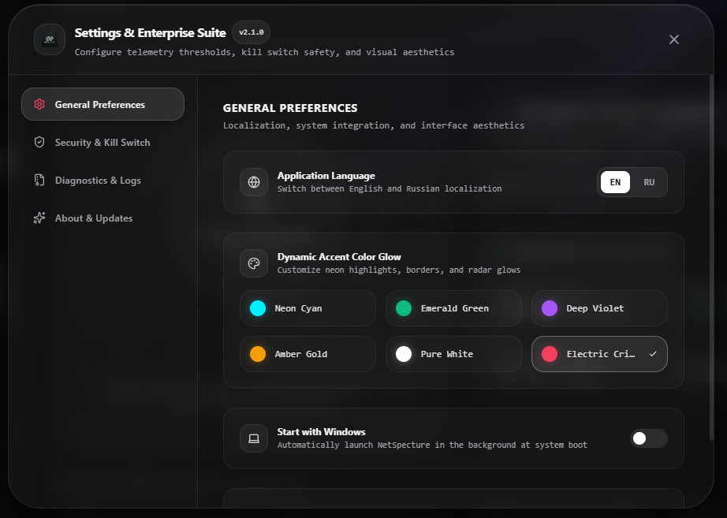

<div align="center">

# 🌐 NetSpecture
### Advanced Network Interface & VPN Tunnel Manager for Windows

[](https://github.com/flypov/netspecture/releases)
[](https://github.com/flypov/netspecture/blob/main/LICENSE)
[](https://electronjs.org/)
[](https://react.dev/)

*A high-performance, low-RAM desktop utility designed to monitor physical adapters, inspect active VPN/proxy tunnels, and deeply optimize your Windows networking stack.*

</div>

---

## ✨ Key Features

- **Smart Interface & Tunnel Management:** Real-time monitoring of physical network adapters (Ethernet/Wi-Fi) alongside virtual VPN overlays (Happ Proxy, AmneziaVPN, Radmin VPN, Tailscale, WireGuard).
- **Deep Process Intelligence:** Instantly tracks daemon execution paths (`happd.exe`), PIDs, memory usage, and CPU consumption.
- **Advanced Network Optimization Engine:** One-click automated stack flush (`/flushdns`, `winsock reset`), interface-specific DNS benchmarking, and smart route metric tuning.
- **System Tray Background Mode:** Run silently in the background, close windows to the tray, and manage states via context menu.
- **Integrated Diagnostics Suite:** Custom UTF-8 encoded traceroute visualizer and multi-node DNS latency tests.
- **Performance Optimized:** Aggressive V8 memory heap restriction keeping idle RAM footprint under ~120MB.
- **Seamless GitHub Auto-Updater:** Built-in self-updating mechanism for effortless version delivery.
- **Bilingual Interface:** Fully localized in English and Russian.

---

## 🖼️️ UI Preview

<div align="center">
  <p><b>Main Telemetry Dashboard</b></p>
  

  <p><b>Network Optimization Center</b></p>
  

  <p><b>Settings & System Configuration</b></p>
  
</div>

---

## 🛠️ Tech Stack

- **Core:** Electron, Node.js
- **Frontend:** React, Vite, Tailwind CSS, Framer Motion, Recharts, Lucide Icons
- **Telemetry:** `systeminformation`, `node-netstat`, `ping`

---

## 🚀 Quick Start

Clone the repository and run the application locally:

```bash
git clone https://github.com/flypov/netspecture.git
cd netspecture
npm install
```

### Run in Development Mode:
```bash
npm run dev
```

### Build Portable Executable / Installer:
```bash
npm run build
```
*(Compiled binaries will be generated in the `dist_electron` directory).*

---

## 👤 Author

* **Developer:** [Flypov](https://github.com/flypov)

---

<div align="center">
  <small>Built with precision and zero-fluff architecture.</small>
</div>